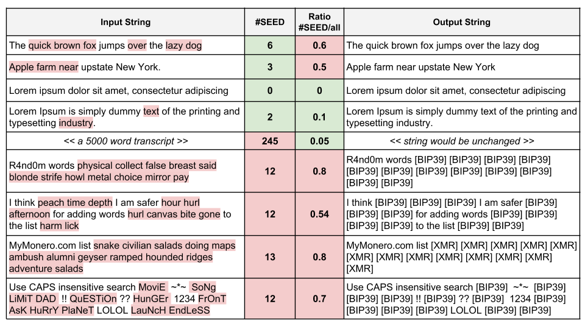

# SeedSieve
This seedSieve function is a tool for redacting cryptocurrency seed mnemonic phrases from text fields or databases to protect users from theft.

## Motivation
Allowing users to accidentally or intentionally/foolishly send or store seed mnemonic phrases in your data sets or streams opens them up to high risk of theft from malicious parties. In almost all cases and services, this increases liabilities and offers no benefits.

The `seedSieve` is an easy method for removing such data, implemented with the BIP39 library, pending inclusion of others. It scans the text to identify strings with high density of seed words, and redacts them. 

## Inputs

`seedSieve` requires 1 input string (to be tested), followed by 4 general parameters that specify the wordlist and adjust sensitivity: 

* **rawStr** : *string* - The input string to be tested and/or redacted.

* **minimumSeedHits** : *int (default=7)* - How many seed words must be observed to trigger redaction

* **seedRatio** : *float (default=0.3)* - Minimum ratio (0,1) of seed:all words to trigger redaction

* **wordlist** : *string/list* - List of words used in cryptocurrency seeds

* **replaceWith** : *string (default="[#BIP39]")* - Short string to replace the redacted words

```Python
>>> from seedSieve import *
>>> [outputString,qTriggered] = seedSieve("very simple example", 1, 0.5, "word example simple test", "[#XYZ]");
>>> print(outputString);
   "very [#XYZ] [#XYZ]"
>>> print(qTriggered);
   1
``` 
## Outputs

`seedSieve` returns two outputs:

* **outputString** : *string* - The redacted version of the output string (`= rawStr input`, if non-seed)

* **qTriggered** : *boolean* - Whether or not the `rawStr` input triggered redaction.


## Example
The following example strings are sieved with the parameters: (minimumSeedHits > 6) & (seedRatio > 0.3). Note that both thresholds must be exceeded to activate redaction



## Implementation notes
Any service that transmits user data and is NOT suitable for sending sensitive financial information (e.g. user logs, message boards, chat services) should implement the seed sieve on the device, before transmitting the field.

Any entity passing along user data to {marketing, analysis, etc, or any third party} should apply the seed sieve first to reduce risk & liability. If this data set is to be used for learning, this should actually increase accuracy by removing the red-herrings (e.g. "apple" being about fruits) and properly labeling the text as cryptocurrency-related.

Please improve and use this code. :- )

## Known bugs:

-  "if wordOnly in wordlist" matches substrings

## Wishlist:

-  Support for other dictionary files besides BIP39 English (other languages & cryptocurrencies)

   -  Could be done by looping over multiple dictionaries (cleaner)

   -  Could be done by making de-duped union of multiple dictionaries (lighter)

-   Sliding seedSieve wrapper: Scan a window of fixed word-size (e.g. N_w = 36 words) across large inputs, and apply seed-sieve redaction to each snip. Imagine a user that pastes a 24-word seed into the middle of the 272 words of the Gettysburg Address. Current implementation would not trigger seed sieve; however, the sliding seed sieve would trigger when the window hits the phrase with 24+ of (N_w = ) 36 words returning dictionary matches.

-    Implementation in other languages. Java? C?

-    Parameters here (default_minimumSeedHits = 7; default_seedRatio = 0.3;) were selected as educated guesses after ~ 20 minutes of glancing through various types of English writing. Open to suggestions for improvements, especially if backed by testing on some seed-spiked corpus, quantified by error metrics (accuracy, false +/- rates, etc)
